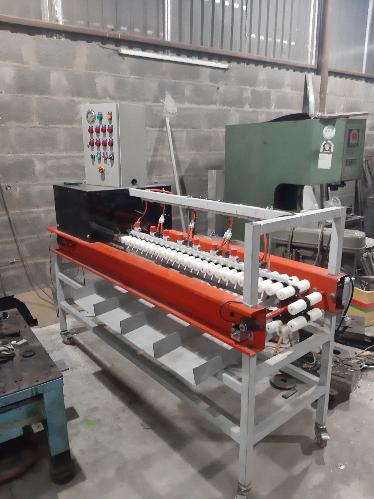
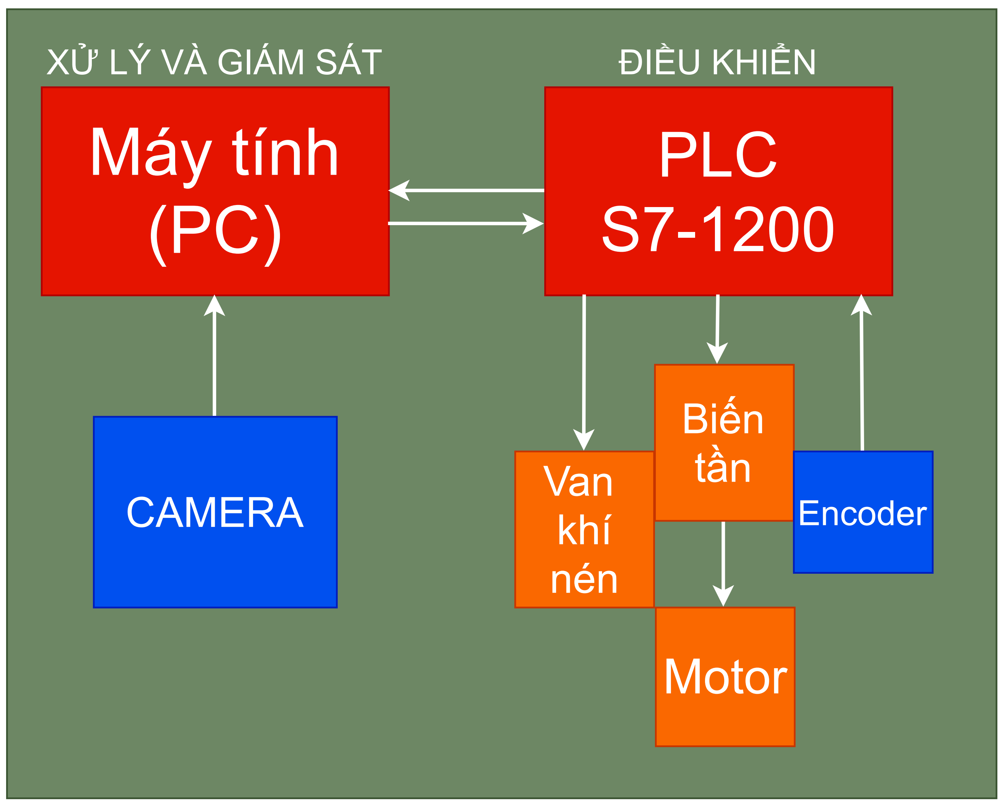
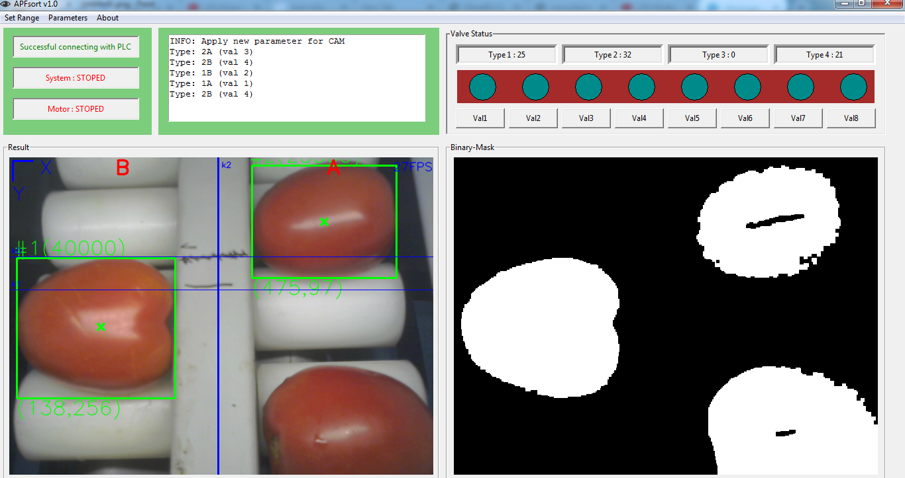

# APFsort_demo
Agricultural Products & Fruits sorting machine (APFsort) DEMO ver1.0

[My Final Project]
The project applies traditional Image Processing methods in classifying agricultural products and fruits (e.g: tomatoes, apples,... ) 

- Programming Language: PYTHON 3
- Image processing library: OpenCV
- Communication library (PLC S7): Snap7
- User interface library: Tkinter 

https://youtu.be/3aFmpllKytA

## MACHINE:
  

## Block diagram
 

## USER INTERFACE
 
